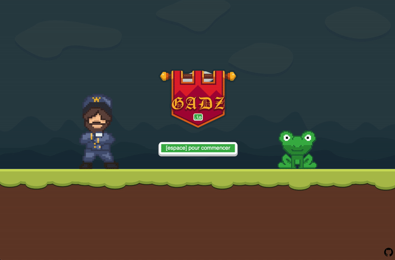

# gadz.io

The simplest and ugliest jumping game you'll find on the internet !

Try it out at [gadz.io](https://gadz.io) !



## Ok, but why this project ???

Because I never used HTML canvas before, and it was a fun way of experimenting with it !

## I understand, but what did you use to build it then ?

Just webpack and plain TypeScript. No React, no fancy stuff.

## I want to build it myself, what should I do ?

```
yarn install
yarn build
```

I told you, nothing fancy.

## License

MIT
